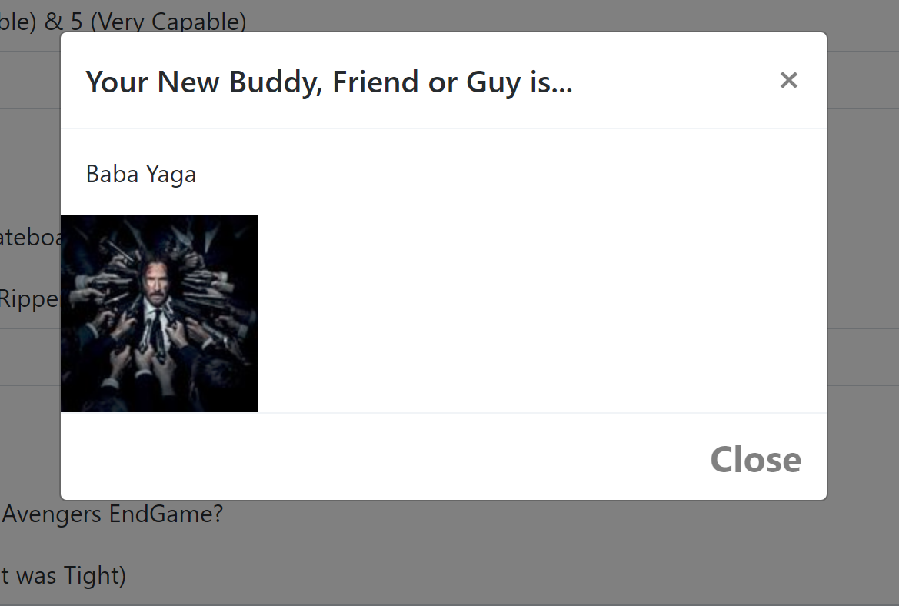

# Friend-Finder
Node &amp; Express Servers

## How to Use Friend Finder
1. On the Friend Finder Home Page, to find a Friend, Buddy or Guy, click on the Survey Button.
2. Fill out the form with your name and a link to your photo.
3. Answer the questions to the best of your ability between 1 - 5. 
4. Click `submit` to be added to the Friend Finder Database.
    * 
5. Friend Finder will process you comments and find the best Friend Buddy or Guy match!

## Friend Matching Logic
1. Friend Finder compares your survey values with the the values of others.
    1. This is performed by running a loop through all the users in the friends Array of Objects
    2. Per Friend, their scores are looped through and compared against your values.
    3. All the values are pushed into a compatibility array to for comparison.
2. The best match value is determined by the user who's values have the least difference between your values.
    1. The compatibility logic determines the lowest number in the compabiliity array
    2. This value determines who your best friend, buddy or guy will be.

## Links
* List of all viewers may be found on the api link at the bottom of the page.

## Deployed
Friend-Finder deployed via Heroku 

## Node Packages used:
- [Express](https://www.npmjs.com/package/express)

